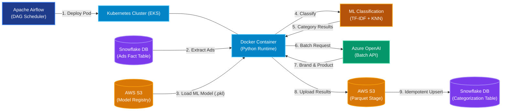
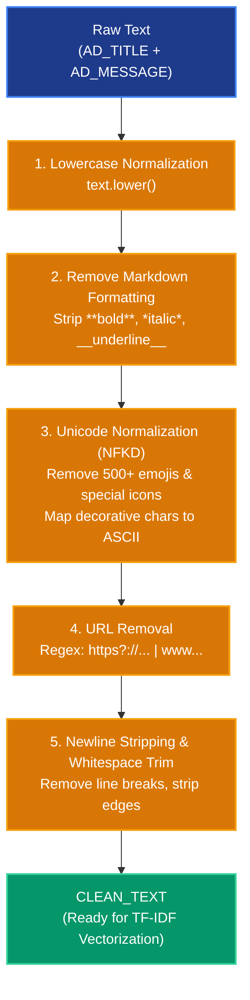
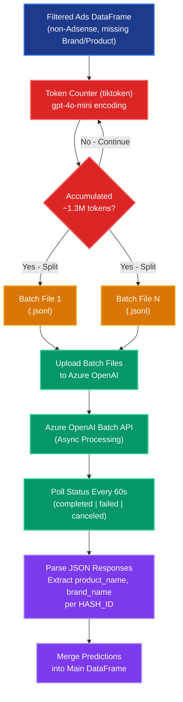

# Production-Grade ML + LLM Pipeline: Facebook Ads Campaign Categorization

This document serves as documentation for the end-to-end hybrid ML & LLM pipeline developed to automatically categorize Facebook advertising campaigns by product category, and extract brand and product names from ad creatives. This system is designed to power advertising analytics dashboards, optimize campaign performance tracking, and enable data-driven marketing insights for the Everpro platform.

> [!NOTE]
> **🏆 Project Impact & Business Success**
> This pipeline is a production-critical system that processes the entire Everpro Facebook ads catalog on a **daily schedule**. It employs a unique **two-stage hybrid architecture** — combining a traditional **multiclass ML classifier** (KNN + TF-IDF) across **22 ad categories** for high-speed category prediction with an **Azure OpenAI Batch API** for intelligent brand and product name extraction. The ML classifier achieves an **accuracy and precision of 86%**, while the hybrid approach balances cost, accuracy, and throughput, delivering structured advertising intelligence at scale.

---

## 🚀 Architecture & Tech Stack

The architecture leverages a cloud-native stack combining traditional ML models with Large Language Models (LLMs) through a batch processing strategy to minimize API costs while maximizing throughput.



| Technology | Role | Details & Rationale |
| :--- | :--- | :--- |
| **Apache Airflow** | **Orchestrator & Scheduler** | Schedules and monitors the pipeline daily (`0 14 * * *` — 9 PM WIB). It dynamically updates Kubernetes configurations to execute workflows in isolated pods, reducing orchestrator resource overhead. |
| **Docker** | **Containerization** | Packages the Python code, ML models, and library dependencies into a portable, versioned Docker image. This guarantees environment consistency between development and production. |
| **Kubernetes (EKS)** | **Compute Engine** | Orchestrated by Airflow using the `KubernetesPodOperator`. The pipeline runs as a transient, auto-scaling Kubernetes pod with resource limits (`1000m`–`1800m` CPU, `2Gi`–`3Gi` Memory) and automatically cleans up upon completion. |
| **AWS S3** | **Model & Data Staging** | 1. **Model Storage:** Stores serialized ML model artifacts (`trained_model.pkl` containing TF-IDF vectorizer, label encoder, and KNN model).<br>2. **Data Staging:** Serves as a staging area for batch predictions (exported as Parquet), allowing fast bulk ingestion. |
| **Snowflake** | **Data Warehousing & Lake** | Acts as both the data source (`core_db.platform_prod.ads_review_detail` — the ads fact table) and the target analytical warehouse (`analytics_db.ml_predictions.fb_ads_categorization`), supporting transactional upserts. |
| **Azure OpenAI** | **LLM Intelligence** | Provides brand and product name extraction via the GPT Batch API. Uses structured system prompts with JSON output formatting to extract `product_name` and `brand_name` from ad creatives at scale with predictable costs. |

---

## 📊 End-to-End Process Flowchart

The diagram below details the operational sequence, starting from pipeline initialization through text preprocessing, ML classification, LLM extraction, and final warehouse synchronization. Colors denote the specific platform and system layer responsible for each step.

```mermaid
flowchart TD
    %% Styling Configuration for High Contrast & Dark/Light Mode Adaptability
    classDef airflow fill:#1E3A8A,stroke:#3B82F6,stroke-width:2px,color:#FFFFFF;
    classDef docker fill:#0284C7,stroke:#38BDF8,stroke-width:2px,color:#FFFFFF;
    classDef extract fill:#0D9488,stroke:#14B8A6,stroke-width:2px,color:#FFFFFF;
    classDef preprocessing fill:#D97706,stroke:#F59E0B,stroke-width:2px,color:#FFFFFF;
    classDef model fill:#059669,stroke:#34D399,stroke-width:2px,color:#FFFFFF;
    classDef llm fill:#DC2626,stroke:#F87171,stroke-width:2px,color:#FFFFFF;
    classDef database fill:#7C3AED,stroke:#A78BFA,stroke-width:2px,color:#FFFFFF;

    %% Orchestration Subgraph
    subgraph Orchestration ["1. Pipeline Initialization"]
        Cron["Airflow Scheduler<br>(Daily Cron: '0 14 * * *')"] --> KPO["KubernetesPodOperator<br>(Launches Docker Container)"]
        KPO --> ExecScript["Execute Python Script<br>(everpro_fb_ads_categorization.py)"]
    end

    %% Data Extraction Subgraph
    subgraph DataExtraction ["2. Raw Data Extraction"]
        ExecScript --> FetchAds["Identify uncategorized ads"]
        FetchAds --> AdsQuery["Query 'core_db.platform_prod.ads_review_detail'<br>(Facebook Ads with title + message > 10 chars)"]
    end

    %% Preprocessing Subgraph
    subgraph TextPreprocessing ["3. Text Preprocessing"]
        AdsQuery --> Prep["Preprocessing Pipeline<br>• Concatenate AD_TITLE + AD_MESSAGE<br>• Lowercase all text<br>• Remove markdown bold/italic<br>• Normalize Unicode and emoticons<br>• Strip URLs and newlines"]
    end

    %% ML Classification Subgraph
    subgraph MLClassification ["4. ML Category Classification"]
        Prep --> LoadModel["Load ML Models from S3<br>(trained_model.pkl)"]
        LoadModel --> TFIDF["TF-IDF Vectorization<br>(Text to Sparse Matrix)"]
        TFIDF --> KNN["KNN Classifier<br>(Predict Ad Category)"]
        KNN --> CategoryResult["Predicted Category<br>(e.g., Fashion, Electronics, etc.)"]
    end

    %% LLM Extraction Subgraph
    subgraph LLMExtraction ["5. LLM Brand & Product Extraction"]
        CategoryResult --> FilterAds["Filter non-Adsense ads<br>with missing Brand/Product"]
        FilterAds --> BatchPrep["Prepare Batch JSONL Files<br>(Token-aware chunking, ~1.3M token limit)"]
        BatchPrep --> OpenAI["Azure OpenAI Batch API<br>(GPT Model)"]
        OpenAI --> ParseJSON["Parse JSON Responses<br>(Extract product_name, brand_name)"]
    end

    %% Persistence Subgraph
    subgraph Persistence ["6. Staging & Warehouse Upsert"]
        ParseJSON --> S3Stage["S3 Staging<br>• Serialize DataFrame to Parquet<br>• Upload to s3://evm-etl/prod/"]
        S3Stage --> SFMerge["Snowflake Upsert<br>• Create temp staging table<br>• MERGE INTO target analytics table"]
        SFMerge --> CleanPod["Kubernetes Pod Auto-Destructs<br>(Complete & clean resources)"]
    end

    %% Apply Styles
    class Cron,KPO airflow;
    class ExecScript docker;
    class FetchAds,AdsQuery extract;
    class Prep preprocessing;
    class LoadModel,TFIDF,KNN,CategoryResult model;
    class FilterAds,BatchPrep,OpenAI,ParseJSON llm;
    class S3Stage,SFMerge,CleanPod database;
```



---

## 🛠️ Deep Dive: Pipeline Execution & Algorithms

### 1. Raw Data Filtering & Extraction
To keep execution times lightweight, the pipeline uses **incremental logic**. Instead of re-categorizing the entire ads database every day, it identifies only uncategorized ads by comparing the source fact table with the existing prediction table.

**SQL Extraction Logic:**
```sql
SELECT
    HASH_ID,
    AD_TITLE,
    AD_MESSAGE,
    AD_CATEGORY,
    BRAND,
    PRODUCT,
    MAX(ad_updated_at) AS last_updated_at
FROM core_db.platform_prod.ads_review_detail
WHERE TRUE
    AND ad_updated_at >= '2025-01-01'
    AND LEN(ad_title) + LEN(ad_message) > 10
    AND hash_id NOT IN (
        SELECT hash_id 
        FROM analytics_db.ml_predictions.fb_ads_categorization
    )
GROUP BY 1,2,3,4,5,6
```

Key filtering criteria:
- **Minimum content length:** Only processes ads where the combined title and message exceed 10 characters, filtering out empty or trivially short entries.
- **Incremental scope:** Excludes ads whose `HASH_ID` already exists in the target table, avoiding redundant computation.

### 2. Text Preprocessing & Cleaning
Facebook ad creatives are inherently noisy — they contain emojis, markdown formatting, special Unicode characters, URLs, and multilingual text. The pipeline implements a robust multi-stage cleaning process:



- **Markdown Removal:** Strips `**bold**`, `*italic*`, `__underline__`, and `_emphasis_` markers using regex substitution.
- **Unicode Normalization (NFKD):** Decomposes characters and removes combining marks (diacritics), then strips 500+ emoji/icon characters from a curated removal list.
- **Special Character Mapping:** Converts decorative Unicode letters (e.g., 🅰 → A, 🅱 → B) back to their ASCII equivalents.
- **URL & Whitespace Cleanup:** Removes HTTP/HTTPS URLs and normalizes whitespace artifacts.

### 3. Stage 1 — Multiclass ML Category Classification (KNN + TF-IDF)
The first classification stage uses a traditional ML approach for high-speed, cost-free ad category prediction. This is a **multiclass classification** problem spanning **22 distinct ad categories** (e.g., Fashion Dewasa, Fashion Anak, Electronics, Health & Beauty, Food & Beverage, etc.). The model achieves an **accuracy of 86%** and a **precision of 86%** on the held-out evaluation set.

#### Model Architecture
The pipeline loads a pre-trained model bundle from S3 (`trained_model.pkl`) containing three serialized components:

| Component | Type | Role |
| :--- | :--- | :--- |
| **TF-IDF Vectorizer** | `TfidfVectorizer` | Converts cleaned ad text into sparse numerical feature vectors based on term frequency–inverse document frequency weights. |
| **Label Encoder** | `LabelEncoder` | Maps categorical labels (e.g., "Fashion Dewasa", "Electronics") to integer class indices and back. |
| **KNN Classifier** | `KNeighborsClassifier` | Classifies ads into categories by finding the K nearest neighbors in TF-IDF feature space. |

#### Prediction Flow
1. **Vectorize:** The cleaned text (`CLEAN_TEXT`) is transformed via the fitted TF-IDF vectorizer into a sparse matrix.
2. **Classify:** The KNN model predicts the category label index from the TF-IDF embedding.
3. **Decode:** The label encoder inverse-transforms the predicted index back into a human-readable category string.

#### NumPy Compatibility Layer
The pipeline includes a custom `NumpyCompatUnpickler` class that handles version mismatches between `numpy._core` and `numpy.core` module paths, ensuring model deserialization works across different NumPy versions deployed in Docker images.

### 4. Stage 2 — LLM Brand & Product Extraction (Azure OpenAI Batch API)
After category classification, the pipeline leverages an LLM to extract structured brand and product information from ads that lack these fields. The pipeline uses the **Azure OpenAI Batch API** instead of synchronous per-request calls — this **batch prediction strategy reduces API costs by up to 50%** (batch pricing vs. standard pricing) and enables **significantly faster throughput** by processing thousands of ads in parallel within a single batch job, rather than making sequential HTTP calls with rate-limit overhead.

#### Token-Aware Batch Preparation
To optimize cost and comply with API limits, the pipeline dynamically chunks requests into JSONL batch files:



#### System Prompt Engineering
The LLM receives a carefully structured system prompt that enforces JSON-only output:
```
You are an expert product naming assistant. Your task is to analyze 
the provided ads description and extract two key pieces of information:
1. Product Name
2. Brand Name

- The product name should be specific. If no match, use "Unidentified".
- The brand name should be specific. If not mentioned, use "Unidentified".
- Output must be in JSON format only.
```

**Example I/O:**
| Input | Output |
| :--- | :--- |
| `Category: Fashion Dewasa. Jual cepat tas kulit pria merk Nike.` | `{"product_name": "Tas kulit", "brand_name": "Nike"}` |

#### Polling & Error Handling
- Each batch job is submitted asynchronously and polled every **60 seconds** until completion.
- Failed batches trigger detailed error logging and raise a `RuntimeError` to halt the pipeline, preventing corrupt data from reaching the warehouse.

---

## 💾 Database Upsert Optimization (S3 Integration)
Writing predictions row-by-row to a cloud database like Snowflake creates significant network overhead and lock contentions. To optimize write performance, the pipeline implements a staged bulk-load architecture:

1. **Parquet Export:** The Pandas DataFrame containing all predictions is written to a fast, compressed Parquet file.
2. **S3 Staging:** The Parquet file is uploaded to AWS S3 (`s3://portfolio-ml-staging/prod/temp_ads_predictions.parquet`).
3. **External Schema Loading:** The script creates a temporary table in Snowflake (`staging_db.temp_ads_predictions`) pointing to the uploaded Parquet file schema.
4. **Idempotent Upsert (Merge):** A Snowflake `MERGE` statement synchronizes data from the temp staging table to the production target table `analytics_db.ml_predictions.fb_ads_categorization` based on `HASH_ID`. This updates any changes and inserts new records without duplicates.

**Final Output Schema:**

| Column | Description |
| :--- | :--- |
| `HASH_ID` | Unique identifier for each ad creative (join key) |
| `AD_TITLE` | Original ad headline |
| `AD_MESSAGE` | Original ad body text |
| `AD_CATEGORY` | Source-provided category (if available) |
| `BRAND` | Source-provided brand (if available) |
| `PRODUCT` | Source-provided product (if available) |
| `LAST_UPDATED_AT` | Most recent ad update timestamp |
| `CLEAN_TEXT` | Preprocessed text used for ML/LLM input |
| `PREDICTED_CATEGORY` | ML-predicted ad category (KNN output) |
| `OPENAI_RESPONSE` | Raw LLM response object (for auditing) |
| `BRAND_PREDICTION` | LLM-extracted brand name |
| `PRODUCT_PREDICTION` | LLM-extracted product name |
| `INPUT_TOKENS` | Prompt token count (for cost tracking) |
| `OUTPUT_TOKENS` | Completion token count (for cost tracking) |
| `META_CREATED_AT` | Pipeline execution timestamp (WIB) |

---

## 🛡️ Production & Operational Safeguards
- **Sensitive Credentials:** Snowflake passwords, AWS Access Keys, and OpenAI API keys are never hardcoded. Instead, they are retrieved from Airflow Variables and injected as environment variables into the Kubernetes pod at runtime.
- **Key-Based Authentication:** Snowflake connections use RSA key-pair authentication (`snow_key_path`) rather than password-based credentials, providing an additional layer of security.
- **Token Cost Control:** LLM costs are **always controlled** end-to-end. The pipeline enforces a per-batch token ceiling (~1.3M tokens) via `tiktoken` pre-counting before any API call is made. Every response's `INPUT_TOKENS` and `OUTPUT_TOKENS` are logged and persisted to the target table, enabling real-time cost accounting, historical spend trending, and anomaly alerting per run.
- **Fail-Safe Monitoring:** The DAG utilizes email-based failure notifications (`email_on_failure: True`) to alert engineers in real-time if a workflow failure occurs.
- **Compute Budget Control:** The Kubernetes Pod enforces memory constraints (`requests: 2Gi`, `limits: 3Gi`) and CPU constraints (`requests: 1000m`, `limits: 1800m`) to avoid resource spike impacts on the core node pools.
- **Incremental Processing:** By filtering out already-categorized ads via `HASH_ID` exclusion, the pipeline avoids reprocessing historical data and minimizes both compute costs and LLM API spend.
- **LLM Batch Error Recovery:** Failed OpenAI batch jobs surface detailed error codes and messages before raising a hard stop, ensuring no partial or corrupted results are written to production.
