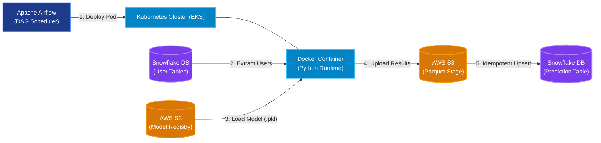

# Production-Grade ML Pipeline: Gender Prediction from Full Names

This document serves as documentation for the end-to-end Machine Learning pipeline developed to predict user gender based on full names. This system is designed to enrich user profiles, power demographic analytics, and enable personalized marketing campaigns for multi-platform retail and e-commerce applications.

> [!NOTE]
> **🏆 Project Impact & Business Success**
> This pipeline is a major production success and is actively used to compile demographic insights for **high-stakes investor reporting** and executive analytics dashboards. By utilizing a optimized hybrid strategy, the classifier achieves a **predictive accuracy of 98%**, outperforming standard LLMs (Large Language Models) in Indonesian naming structures.

---

## 🚀 Architecture & Tech Stack

The architecture leverages a cloud-native, scalable stack to isolate compute, automate scheduling, and optimize database write throughput.



| Technology | Role | Details & Rationale |
| :--- | :--- | :--- |
| **Apache Airflow** | **Orchestrator & Scheduler** | Schedules and monitors the pipeline weekly. It dynamically updates Kubernetes configurations to execute workflows in isolated pods, reducing orchestrator resource overhead. |
| **Docker** | **Containerization** | Packages the Python code, system packages, and library dependencies into a portable, versioned Docker image. This guarantees environment consistency between development and production. |
| **Kubernetes (EKS)** | **Compute Engine** | Orchestrated by Airflow using the `KubernetesPodOperator`. The pipeline runs as a transient, auto-scaling Kubernetes pod with resource limits (`500m`-`1000m` CPU, `256Mi`-`1Gi` Memory) and automatically cleans up upon completion. |
| **AWS S3** | **Model & Data Staging** | 1. **Model Storage:** Stores serialized ML model artifacts (e.g., `trained_model.pkl`).<br>2. **Data Staging:** Serves as a staging area for batch predictions (exported as Parquet), allowing fast bulk ingestion. |
| **Snowflake** | **Data Warehousing & Lake** | Acts as both the data source (user directory tables from separate platforms) and the target analytical warehouse (`GENDER_PREDICTION`), supporting transactional upserts. |

---

## 📊 End-to-End Process Flowchart

The diagram below details the operational sequence, starting from pipeline initialization down to preprocessing, predictions, and final warehouse synchronization. Colors denote the specific platform and system layer responsible for each step.

```mermaid
flowchart TD
    %% Styling Configuration for High Contrast & Dark/Light Mode Adaptability
    classDef airflow fill:#1E3A8A,stroke:#3B82F6,stroke-width:2px,color:#FFFFFF;
    classDef docker fill:#0284C7,stroke:#38BDF8,stroke-width:2px,color:#FFFFFF;
    classDef extract fill:#0D9488,stroke:#14B8A6,stroke-width:2px,color:#FFFFFF;
    classDef preprocessing fill:#D97706,stroke:#F59E0B,stroke-width:2px,color:#FFFFFF;
    classDef model fill:#059669,stroke:#34D399,stroke-width:2px,color:#FFFFFF;
    classDef database fill:#7C3AED,stroke:#A78BFA,stroke-width:2px,color:#FFFFFF;

    %% Orchestration Subgraph
    subgraph Orchestration ["1. Pipeline Initialization"]
        Cron["Airflow Scheduler<br>(Weekly Cron: '05 19 * * 2')"] --> KPO["KubernetesPodOperator<br>(Launches Docker Container)"]
        KPO --> ExecScript["Execute Python Script<br>(gender_prediction_from_name.py)"]
    end

    %% Data Extraction Subgraph
    subgraph DataExtraction ["2. Raw Data Extraction"]
        ExecScript --> FetchUsers["Identify unscored users"]
        FetchUsers --> PlatformAQuery["Query 'core_db.platform_a_users'<br>(Platform A Users)"]
        FetchUsers --> PlatformBQuery["Query 'core_db.platform_b_users'<br>(Platform B Users)"]
    end

    %% Preprocessing & Modeling Subgraph
    subgraph PreprocessingModeling ["3. Preprocessing & ML Modeling"]
        PlatformAQuery & PlatformBQuery --> Prep["Preprocessing (Regex & Pandas)<br>• Lowercase name strings<br>• Remove numbers/symbols via regex<br>• Flag clean alphabetic names<br>• Map existing genders (male -> 1, female -> 0)"]
        Prep --> LoadModel["Load ML Models<br>(trained_model.pkl from S3/local)"]
        LoadModel --> Decider{"Word Confidence<br>!= Prior?"}
        Decider -- "Yes" --> WordBayes["Method 1: Word-Based Naive Bayes"]
        Decider -- "No" --> SyllablePredict["Method 2: Syllable Fallback"]
        WordBayes & SyllablePredict --> MapLabels["Map Predicted Class to Label<br>(1 -> 'male', 0 -> 'female')"]
    end

    %% Persistence Subgraph
    subgraph Persistence ["4. Staging & Warehouse Upsert"]
        MapLabels --> S3Stage["S3 Staging<br>• Serialize DataFrame to Parquet<br>• Upload to s3://portfolio-ml-staging/"]
        S3Stage --> SFMerge["Snowflake Upsert<br>• Create temp staging table<br>• MERGE INTO target analytics table"]
        SFMerge --> CleanPod["Kubernetes Pod Auto-Destructs<br>(Complete & clean resources)"]
    end

    %% Apply Styles
    class Cron,KPO,ExecScript airflow;
    class ExecScript docker;
    class PlatformAQuery,PlatformBQuery,FetchUsers extract;
    class Prep preprocessing;
    class LoadModel,Decider,WordBayes,SyllablePredict,MapLabels model;
    class S3Stage,SFMerge,CleanPod database;
```



---

## 🛠️ Deep Dive: Pipeline Execution & Algorithms

### 1. Raw Data Filtering & Extraction
To keep execution times lightweight, the pipeline uses **incremental logic**. Instead of scoring the entire user database every week, it identifies net-new users by joining the user directory with the existing target prediction table.

**SQL Extraction Logic (Platform A Example):**
```sql
SELECT 
    u.user_id::TEXT AS user_id,
    u.full_name,
    u.gender
FROM core_db.platform_a_users u
LEFT JOIN analytics_db.gender_prediction gp 
    ON gp.user_id = u.user_id::TEXT
WHERE u.full_name IS NOT NULL 
    AND gp.user_id IS NULL; -- Extracts only users without a prediction record
```

### 2. Preprocessing & Text Cleaning
Names are messy and often contain special characters, titles, or numbers. The text cleaning process standardizes the names using raw string operations and regular expressions:
- **Case Standardization:** Convert all characters to lowercase.
- **Noise Removal:** Apply regex `[^a-z]+` to replace non-alphabetic characters (e.g., punctuation, numbers, emojis) with whitespace.
- **Alphabetic Flagging:** Strip spaces and run `.isalpha()` to label cleanly formed names vs. names containing problematic entries.

### 3. The Hybrid ML Prediction Strategy
The core algorithm relies on a **Hybrid Classifier Setup** combining two models to maximize accuracy and coverage:

```
                  ┌──────────────────────────────┐
                  │          Clean Name          │
                  └──────────────┬───────────────┘
                                 │
                                 ▼
                  ┌──────────────────────────────┐
                  │  Naive Bayes (Word-Based)    │
                  └──────────────┬───────────────┘
                                 │
                     Confidence != Prior?
                                 │
                   ┌─────────────┴─────────────┐
                   ▼ Yes                       ▼ No
         ┌───────────────────┐       ┌───────────────────┐
         │ Use Word-Based ML │       │ Use Syllable-Based│
         │  Class Prediction │       │  Fallback Model   │
         └───────────────────┘       └───────────────────┘
```

#### Method A: Word-Based Naive Bayes
This model split-processes names into individual words and sums up their log-likelihood values starting from the prior probability.
- **Why it works:** Names often have highly gender-indicative words (e.g., specific prefixes/suffixes or culturally gendered names).
- **Condition:** If the algorithm encounters a name consisting *only* of unseen words, the total log-likelihood score stays exactly at the prior value (meaning no evidence was found).

#### Method B: Syllable-Based Classifier (Fallback)
If the name is completely unseen in the Word-Based model (confidence matches the prior), the pipeline falls back to the **Syllable-Based ML Model**.
- **Why it works:** Indonesian names contain phoneme patterns (e.g., names ending in "-to", "-wan", "-din" are typically male, while those ending in "-ti", "-a", "-ni" are typically female).
- **Integration:** The syllable model acts as a robust generalization fallback, ensuring the pipeline achieves **100% scoring coverage** on clean names.

---

## 💾 Database Upsert Optimization (S3 Integration)
Writing predictions row-by-row to a cloud database like Snowflake creates significant network overhead and lock contentions. To optimize write performance, the pipeline implements a staged bulk-load architecture:

1. **Parquet Export:** The Pandas dataframe containing predicted users is written to a fast, compressed Parquet file.
2. **S3 Staging:** The Parquet file is uploaded to AWS S3 (`s3://portfolio-ml-staging/prod/temp_gender_prediction.parquet`).
3. **External Schema Loading:** The script creates a temporary table in Snowflake (`staging_db.temp_gender_predictions`) pointing to the uploaded Parquet file schema.
4. **Idempotent Upsert (Merge):** A Snowflake `MERGE` statement synchronizes data from the temp staging table to the production target table `analytics_db.gender_predictions` based on `user_id`. This updates any changes and inserts new records without duplicates.

```sql
MERGE INTO analytics_db.gender_predictions AS target
USING staging_db.temp_gender_predictions AS source
ON target.USER_ID = source.USER_ID
WHEN MATCHED THEN
    UPDATE SET 
        target.full_name = source.full_name,
        target.gender = source.gender,
        target.predicted_gender = source.predicted_gender,
        target.source_platform = source.source_platform
WHEN NOT MATCHED THEN
    INSERT (USER_ID, FULL_NAME, GENDER, PREDICTED_GENDER, SOURCE_PLATFORM)
    VALUES (source.USER_ID, source.FULL_NAME, source.GENDER, source.PREDICTED_GENDER, source.source_platform);
```

---

## 🛡️ Production & Operational Safeguards
- **Sensitive Credentials:** AWS Access Keys, Secret Keys, and Snowflake Passwords are never hardcoded. Instead, they are retrieved from Airflow Variables and decrypted dynamically using **Fernet Encryption** at execution time.
- **Fail-Safe Monitoring:** The DAG utilizes custom notifications (`on_failure_callback`) to alert engineers in real-time if a workflow failure occurs.
- **Compute Budget Control:** The Kubernetes Pod enforces memory constraints (`requests` and `limits`) to avoid memory leak spikes affecting the core node pools.
