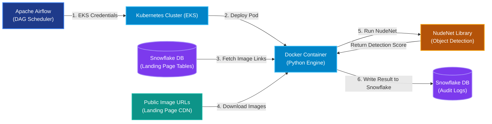

# Production-Grade Computer Vision Pipeline: Automated Landing Page Nude Detection

This document serves as documentation for the end-to-end Computer Vision (CV) pipeline developed to scan and review images on landing pages on our platform. The system automatically detects inappropriate or sensitive imagery (such as genitalia or adult content) to maintain platform safety, ensure compliance with brand guidelines, and safeguard the platform's public reputation.

---

## 🏆 Case Study: Business Impact & Automation

After a critical incident where scam content led to landing page domain bans—affecting over 100 users, disrupting services, and exposing the company to substantial financial and legal liabilities—I spearheaded the development of an automated Computer Vision pipeline to filter nudity and ensure platform compliance with regulatory guidelines.

Collaborating closely with Product Management, Operations, and Business Intelligence, I researched cost-effective AI methods and established optimal classification thresholds to minimize false positives. I then designed and implemented the automated pipeline, replacing a laborious manual review process (100–200 pages daily) with an automated scan. 

This system successfully prevented subsequent domain bans, eliminated legal risk, and streamlined operations—empowering the Ops team to shift from manual page-by-page checks to auditor roles reviewing only flagged violations.

---

## 🚀 Architecture & Tech Stack

The architecture leverages a containerized, cloud-native workflow that schedules jobs via Apache Airflow and runs high-resource machine learning inference on an isolated, auto-scaling Kubernetes cluster.



| Technology | Role | Details & Rationale |
| :--- | :--- | :--- |
| **Apache Airflow** | **Orchestrator & Scheduler** | Triggers the pipeline daily. Runs EKS configuration steps via `BashOperator` and spawns the executor via `KubernetesPodOperator`. |
| **Docker** | **Containerization** | Packages the Python runtime and NudeNet library to guarantee environment consistency between development and production. |
| **Kubernetes (EKS)** | **Compute Engine** | Executes the container inside the designated namespace. Resource parameters requests (`800m` CPU, `256Mi` Memory) and limits (`1000m` CPU, `4Gi` Memory) are optimized to handle heavy deep learning model loads safely without disrupting other microservices. |
| **NudeNet (NudeDetector)** | **Computer Vision Framework** | An open-source pre-trained deep learning detector. Loads `NudeDetector` to locate and classify sensitive body parts, specifically isolating the `GENITALIA` label to flag violation events. |
| **Snowflake** | **Data Warehousing & Lake** | Extracts landing page components updated in the last 24 hours (`D-1` incremental) and acts as the target audit logs table. |

---

## 📊 End-to-End Process Flowchart

The flowchart below outlines the execution sequence of the daily pipeline, detailing data extraction, batch model processing, and Snowflake ingestion:

```mermaid
flowchart TD
    %% Styling Configuration
    classDef airflow fill:#1E3A8A,stroke:#3B82F6,stroke-width:2px,color:#FFFFFF;
    classDef docker fill:#0284C7,stroke:#38BDF8,stroke-width:2px,color:#FFFFFF;
    classDef extract fill:#0D9488,stroke:#14B8A6,stroke-width:2px,color:#FFFFFF;
    classDef preprocessing fill:#D97706,stroke:#F59E0B,stroke-width:2px,color:#FFFFFF;
    classDef model fill:#059669,stroke:#34D399,stroke-width:2px,color:#FFFFFF;
    classDef database fill:#7C3AED,stroke:#A78BFA,stroke-width:2px,color:#FFFFFF;

    %% Orchestration
    subgraph Orchestration ["1. Pipeline Initialization"]
        Cron["Airflow Scheduler<br>(Daily Cron: '30 23 * * *')"] --> ConfigKube["Update Kubeconfig<br>(aws eks CLI)"]
        ConfigKube --> KPO["KubernetesPodOperator<br>(Launches Worker Pod)"]
        KPO --> GitClone["Git Clone Repository<br>(CI/CD bot auth)"]
    end

    %% Data Fetching
    subgraph DataExtraction ["2. Incremental Data Extraction"]
        GitClone --> ExecPython["Run Python Script"]
        ExecPython --> SnowExtract["Query Database<br>(Extract D-1 components where type = 'image')"]
    end

    %% Processing
    subgraph ImageProcessing ["3. Downloading & Object Detection"]
        SnowExtract --> Download["Download Image Files<br>(HTTP GET requests saved as local files)"]
        Download --> LoadModel["Instantiate NudeDetector<br>(Load weights into memory)"]
        LoadModel --> RunInference["Run NudeNet Library<br>(detector.detect)"]
    end

    %% Ingestion
    subgraph Ingestion ["4. Label Formatting & Ingestion"]
        RunInference --> FilterLabels["Post-Process Predictions<br>• Filter labels for 'GENITALIA'<br>• Join multiple classes & scores<br>• Set is_nude_detected = TRUE"]
        FilterLabels --> LoadSF["Write Result to Snowflake"]
        LoadSF --> Terminate["Pod terminates successfully"]
    end

    %% Apply Styles
    class Cron,ConfigKube,KPO,GitClone airflow;
    class ExecPython docker;
    class SnowExtract extract;
    class Download,LoadModel,RunInference preprocessing;
    class FilterLabels model;
    class LoadSF,Terminate database;
```



---

## 🛠️ Deep Dive: Pipeline Components

### 1. Incremental Landing Page Component Filtering
To keep pipeline execution fast and database reads minimized, the script uses **incremental daily filters**. The query selects only components updated on the previous day.

**SQL Extraction Logic:**
```sql
SELECT 
    lpc.landing_page_id, 
    lpc.component_detail 
FROM landing_page_components lpc
LEFT JOIN landing_page_dim lp
    ON lpc.landing_page_id = lp.landing_page_id
WHERE lpc.component_type = 'image'
  AND DATE(lpc.updated_at) = DATE(CURRENT_TIMESTAMP) - INTERVAL '1 day'
  AND lpc.component_detail ILIKE '%http%'
ORDER BY 1, 2;
```

### 2. NudeNet Inference & Violation Labeling
The script instantiates the `NudeDetector` object and performs inference through the `nude_detect` wrapper.

#### Post-Processing Logic:
- **`join_class`**: Isolates only predictions containing the `'GENITALIA'` class, joining them into a comma-separated string (e.g. `"GENITALIA,GENITALIA"`).
- **`join_score`**: Extracts corresponding confidence scores, joining them (sliced to 4 characters for formatting, e.g. `"0.84,0.91"`).
- **`is_nude_detected`**: A boolean flag set to `True` if the class string contains `'GENITALIA'`.

---

## 💾 Database Output Schema

The results of the analysis are appended directly to the target audit logs table in the Snowflake warehouse:

| Column | Data Type | Description |
| :--- | :--- | :--- |
| **`landing_page_id`** | `VARCHAR` | Unique identifier of the evaluated landing page. |
| **`image`** | `VARCHAR` | The URL of the scanned image component. |
| **`label`** | `VARCHAR` | Comma-separated list of violation classes found (e.g., `'GENITALIA'`). |
| **`score`** | `VARCHAR` | Comma-separated list of detection confidence scores. |
| **`is_nude_detected`** | `BOOLEAN` | Flags whether a violation has been detected (`TRUE`/`FALSE`). |
| **`ingest_at`** | `TIMESTAMP` | Execution ingest timestamp. |

---

## 🛡️ Production & Operational Safeguards

- **Fernet Encrypted Credentials**: Variable lookups (such as credentials and cloud secrets) are fetched via Airflow's encrypted Variables pool. Decryption is performed dynamically using Fernet cryptography prior to execution.
- **EKS Network Rules & Pod Scoping**: The worker pod runs inside the isolated namespace. It runs using custom tolerations and node selectors to restrict execution to specific batch-job nodes.
- **Resource Constraints**: Deep learning models are highly memory-intensive. The pipeline configures memory limits to `4Gi` to prevent **Out-Of-Memory (OOM)** failures during image load operations, while capping standard CPU consumption to `1.0` core.
