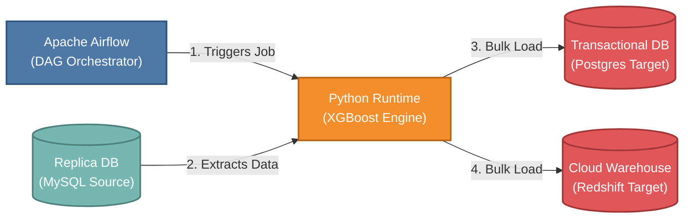
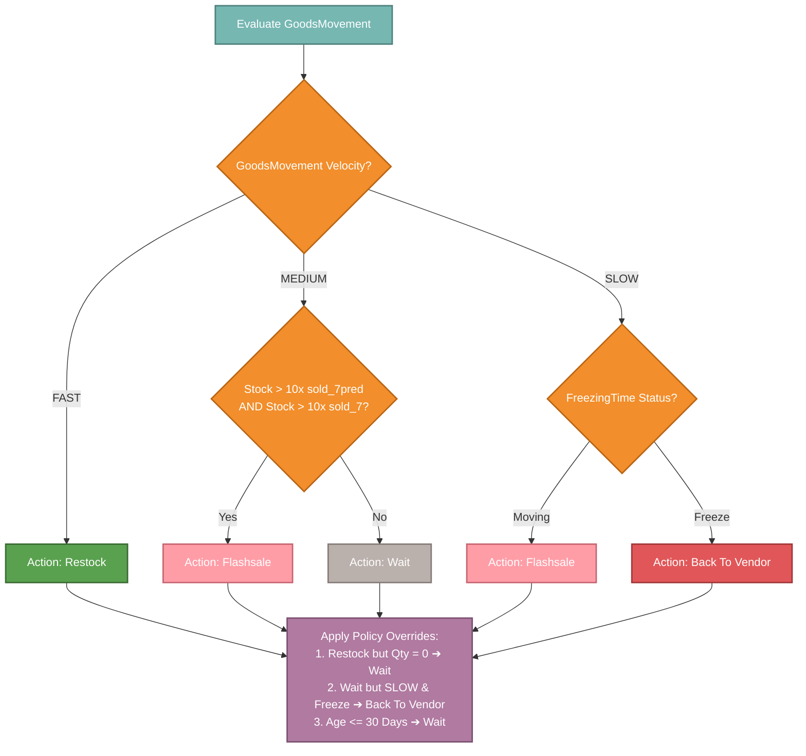
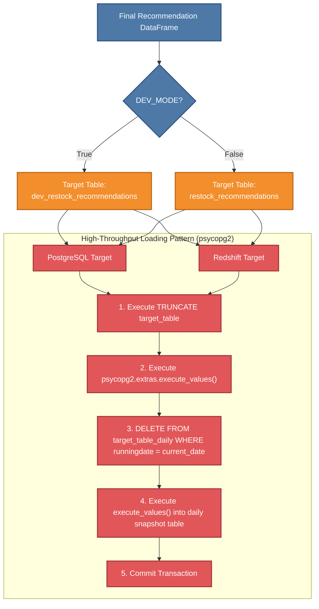

# Production-Grade ML Pipeline: Intelligent Inventory & Restock Recommendation

This document provides comprehensive documentation for the end-to-end Machine Learning pipeline developed to predict product sales, optimize inventory levels, and generate actionable restocking and pricing recommendations. By integrating time-series sales aggregation, on-the-fly XGBoost modeling, and statistical category-aware pricing heuristics, this pipeline helps minimize capital lockup in slow-moving inventory while preventing stockouts of high-velocity items.

> [!NOTE]
> **🏆 Project Impact & Business Success (STAR Framework)**
> * **Situation**: Inventory managers and supply chain operations manually set stock levels across multiple fulfillment centers and sales channels, leading to either capital locked up in frozen/slow-moving inventory or frequent stockouts of high-demand items.
> * **Task**: Build a fully automated, schedule-driven intelligence system to forecast weekly demand per SKU, recommend operational actions (Restock, Flashsale, Return to Vendor, or Wait), and compute risk-managed restock quantities and optimal markdown price ranges.
> * **Action**: Developed an end-to-end predictive pipeline orchestrated by Apache Airflow. The system extracts multi-channel transactional records, trains a localized XGBoost regressor on-the-fly, processes outputs through dynamic business rules, and loads results via high-throughput bulk insertions into PostgreSQL (for customer-facing applications) and Cloud Warehouse (for BI dashboards).
> * **Result**: Streamlines supply chain operations, significantly reducing overstocking risks, automating supplier returns, and optimizing markdown sales recovery using price elasticity signals.

---

## 🚀 Architecture & Tech Stack

The pipeline isolates extraction, modeling, post-processing, and storage layers. It is designed to be database-agnostic, using a secure replica source to run heavy queries without impacting production transactional databases.

| Technology | Role | Details & Rationale |
| :--- | :--- | :--- |
| **Apache Airflow** | **Orchestration & Security** | Triggers the pipeline daily (`0 22 * * *`). It reads database credentials, encrypts them using **Fernet Symmetric Cryptography**, and passes them to the downstream runner via XCom execution variables to prevent plaintext leaks. |
| **Python 3.7+** | **Execution Engine** | Coordinates data extraction, runs preprocessing/feature engineering, fits the XGBoost regression model, evaluates modeling metrics, and applies business rules. |
| **XGBoost (Regressor)** | **Demand Forecasting** | Learns local trend coefficients from historical rolling sales (1-day, 7-day, 30-day lookbacks) and daily lag distributions to predict unit demand over the next 7 days (`sold_next7D`). |
| **MySQL Replica** | **Source Database** | Hosts production transactional and catalog tables. The pipeline reads from an isolated read-replica (`db-replica.internal-retailco.com`) to prevent locking issues on live order tables. |
| **PostgreSQL** | **Operational Target** | Serves operational inventory tools and admin interfaces by storing current recommendations (`restock_recommendations` and historical tracker `restock_recommendations_daily`). |
| **Redshift** | **Analytical Target** | Power business intelligence dashboards and executive reports with warehouse tables synced in parallel with PostgreSQL. |

---

## 📊 End-to-End Process Flowchart

The flowchart below maps the operational pipeline sequence from DAG initialization, feature preparation, on-the-fly machine learning, heuristic business policy execution, to parallel multi-database ingestion.

```mermaid
flowchart TD
    %% Class Definitions using Tableau 10 Color Palette
    classDef blue fill:#4E79A7,stroke:#2D547E,stroke-width:2px,color:#FFFFFF;
    classDef orange fill:#F28E2B,stroke:#B96515,stroke-width:2px,color:#FFFFFF;
    classDef teal fill:#76B7B2,stroke:#4E807C,stroke-width:2px,color:#FFFFFF;
    classDef green fill:#59A14F,stroke:#3B6B34,stroke-width:2px,color:#FFFFFF;
    classDef purple fill:#B07AA1,stroke:#7D5072,stroke-width:2px,color:#FFFFFF;
    classDef red fill:#E15759,stroke:#A13637,stroke-width:2px,color:#FFFFFF;

    subgraph Initialization ["1. Pipeline Initialization & Security"]
        Cron["Airflow Cron<br>(Daily '0 22 * * *')"] --> GetCreds["PythonOperator: get_credentials"]
        GetCreds --> Encrypt["Fetch variables & encrypt<br>with Fernet key"]
        Encrypt --> RunBash["BashOperator: run main.py<br>(Pass next_ds & decrypted payload)"]
    end

    subgraph Extraction ["2. SQL Data Extraction"]
        RunBash --> RunSQL["Execute SQL Query<br>(query_predict.sql)"]
        RunSQL --> QueryCore["Query retail_core database"]
        RunSQL --> QueryPartner["Query retail_partner database"]
        QueryCore & QueryPartner --> MergeData["Consolidate orders & join<br>with catalog metadata"]
    end

    subgraph Modeling ["3. On-The-Fly ML Modeling"]
        MergeData --> PrepML["Preprocess Training Set<br>(Filter active, recently sold items)"]
        PrepML --> SplitML["Train/Test Split (80/20)"]
        SplitML --> TrainML["Fit XGBRegressor<br>(n_estimators=10, max_depth=5)"]
        TrainML --> LogMetrics["Compute & log performance<br>(MSE & MAE scores)"]
        LogMetrics --> Predict["Predict next 7 days sales<br>(sold_7pred via np.ceil)"]
    end

    subgraph BusinessRules ["4. Multi-Decision Rules Engine"]
        Predict --> CalcFreeze["Compute FreezingTime<br>(Freeze vs Moving)"]
        Predict --> CalcMovement["Categorize GoodsMovement<br>(FAST, MEDIUM, SLOW by category)"]
        CalcFreeze & CalcMovement --> CalcAction["Action Recommendation<br>(Restock, Flashsale, Back To Vendor, Wait)"]
        CalcAction --> CalcStock["Compute Restock Quantity<br>(3x or 4x forecast buffer)"]
        CalcStock --> CalcRisk["Evaluate Risks & Loss<br>(Low/Med/High Risk & Potential Loss)"]
        CalcRisk --> CalcPrice["Dynamic Price & Markdown Optimization<br>(Dynamic floor/ceil price boundaries)"]
        CalcPrice --> ApplyOverrides["Apply Policy Overrides<br>(Grace period, zero restock)"]
    end

    subgraph Persistence ["5. Database Sync"]
        ApplyOverrides --> WritePostgres["Overwrite PostgreSQL<br>• Truncate target table<br>• Insert values in bulk<br>• Upsert daily run history"]
        ApplyOverrides --> WriteRedshift["Overwrite Redshift<br>• Truncate target table<br>• Insert values in bulk<br>• Upsert daily run history"]
    end

    class Cron,GetCreds,Encrypt,RunBash blue;
    class RunSQL,QueryCore,QueryPartner,MergeData teal;
    class PrepML,SplitML,TrainML,LogMetrics,Predict green;
    class CalcFreeze,CalcMovement,CalcAction,CalcStock,CalcRisk,CalcPrice,ApplyOverrides purple;
    class WritePostgres,WriteRedshift red;
```

---

## 🛠️ Deep Dive: Pipeline Execution & Algorithms

### 1. Unified Multi-Platform Data Extraction
To predict future demand and aggregate descriptive trends, the SQL pipeline (`query_predict.sql`) extracts transaction data from multiple sales platform schemas (`retail_core` and `retail_partner`) and merges them:

The database operations query both the primary sales channels and partner networks, combining transaction dates, quantities, and customer pricing attributes. It aggregates transaction volumes and revenues across rolling lookback windows (1-day, 7-day, and 30-day intervals) alongside historical distinct active sales days. Crucially, the extraction compiles forward-looking sales records (`sold_next1D` and `sold_next6D`) to serve as the ground-truth target label during the on-the-fly model training phase.

The feature set is combined with:
- **Sales Days (`SalesDay`)**: Counts distinct calendar days with successful sales across 1-day, 7-day, 14-day, 30-day, and 60-day intervals, plus a Recency score (`last_sold_day` representing the count of days since the last sale).
- **Promotion Status (`flashsale_item`)**: Flag indicating if the product was sold with a discount (`discountPrice > 0`) during the previous week.
- **Product Metadata (`Active_product`)**: Joins product model, brand, hierarchy levels (`level1`, `level2`, `level3`), and current warehouse inventory (`stockqty`).

### 2. Machine Learning Model Training (On-The-Fly)
Rather than executing static inference against stale offline models, the pipeline fits a new demand model during each execution run to capture immediate market changes.

* **Preprocessing**: It copies the SQL dataset and filters only "active, moving inventory" to avoid skewing predictions with dead stock:
  `activestatus == "Active" and last_sold_day < 30 and stockqty > 0`
* **Target Variable**: Sum of future lead metrics:
  `sold_next7D = sold_next1D + sold_next6D`
* **Model Choice**: XGBoost Regressor (`objective='reg:squarederror'`). Since it is run daily, parameters are set to a fast, regularized profile:
  - `n_estimators = 10`
  - `max_depth = 5`
  - `learning_rate = 0.1`
  - `colsample_bytree = 0.3`
  - `alpha = 10`
* **Logging**: Evaluates performance on a randomized 20% test partition, outputting the Mean Squared Error (MSE) and Mean Absolute Error (MAE) directly to Airflow logs.

---

## 🧠 Business Rules & Recommendations Logic

After predicting the next 7 days of sales (referred to as `sold_7pred`), the pipeline runs heuristic algorithms (`detail_features.py` and `write.py`) to derive actionable operational decisions:

### 1. Freezing Time
Identifies if inventory has entered a stagnant period.
* **Logic**: If an active product has a recency score (`last_sold_day >= 30`) AND either has less than 4 sales days in the 30-to-60-day lag window (`sd_30_60 < 4`) OR has a flat sales growth profile (`sd_all - sd_30_60 < 5`), it is tagged as **"Freeze"**.
* **Otherwise**: Tagged as **"Moving"**.

### 2. Category-Aware Goods Movement
Categorizes products into **FAST**, **MEDIUM**, or **SLOW** velocities. The threshold depends on the top-level product category (`level1`):

| Category Cluster | Slow-Moving Trigger | Fast-Moving Trigger |
| :--- | :--- | :--- |
| **Electronics** | `sold_7 < 2` OR `sold_30 < 11` AND `stockqty > 0` AND `liveday > 45` days | `(sold_7 > 5` AND `sd_30 > 21)` OR `sd_30 > 15` AND `last_sold_day < 7` days |
| **Religious Attire, Home & Living** | `sold_7 < 2` OR `sold_30 < 6` AND `stockqty > 0` AND `liveday > 45` days | `(sold_7 > 12` AND `sd_30 > 7)` OR `sd_30 > 36` AND `last_sold_day < 7` days |
| **Vouchers & Gift Cards** | `sold_7 < 2` OR `sold_30 < 2` AND `stockqty > 0` AND `liveday > 45` days | `(sold_7 > 6` AND `sd_30 > 2)` OR `sd_30 > 18` AND `last_sold_day < 7` days |
| **Health, Food, Beverages** | `sold_7 < 3` OR `sold_30 < 10` AND `stockqty > 0` AND `liveday > 45` days | `(sold_7 > 9` AND `sd_30 > 15)` OR `sd_30 > 27` AND `last_sold_day < 7` days |
| **Fashion (Adult & Kids), Beauty, Sports, Auto** | `sold_7 < 2` OR `sold_30 < 4` AND `stockqty > 0` AND `liveday > 45` days | `(sold_7 > 3` AND `sd_30 > 8)` OR `sd_30 > 9` AND `last_sold_day < 7` days |
| **Stationery & Crafts** | `sold_7 < 1` OR `sold_30 < 3` AND `stockqty > 0` AND `liveday > 45` days | `(sold_7 > 2` AND `sd_30 > 4)` OR `sd_30 > 6` AND `last_sold_day < 7` days |
| **Books** | `sold_7 < 2` OR `sold_30 < 6` AND `stockqty > 0` AND `liveday > 45` days | `(sold_7 > 11` AND `sd_30 > 12)` OR `sd_30 > 33` AND `last_sold_day < 7` days |
| *Other / Default* | `sold_7 < 1` OR `sold_30 < 3` AND `stockqty > 0` AND `liveday > 45` days | `(sold_7 > 7` AND `sd_30 > 7)` OR `sd_30 > 30` AND `last_sold_day < 7` days |

*Where **sold_x** is units sold over **x** days, **sd_x** is distinct sales days over **x** days, **stockqty** is current warehouse quantity, and **liveday** is catalog age in days.*

### 3. Action Recommendations Strategy
A combined state machine evaluates recommendations and safety overrides:

1. **Restock**: Recommended if `goodsmovement == 'FAST'`.
    - **Quantity Recommended**:
        - If `stockqty < 3 * sold_7pred`, recommend: `3 * sold_7pred - stockqty`
        - If `stockqty >= 3 * sold_7pred` and `4 * sold_7pred - stockqty > 0`, recommend: `4 * sold_7pred - stockqty`
        - Otherwise: `0`
2. **Flashsale**: Recommended if:
    - `goodsmovement == 'MEDIUM'` and current stock is highly over-allocated (`stockqty > 10 * sold_7pred` and `stockqty > 10 * sold_7`).
    - `goodsmovement == 'SLOW'` and the inventory is still active and flowing (`freezingtime == 'Moving'`).
3. **Back to Vendor (Supplier Return)**: Recommended if:
    - `goodsmovement == 'SLOW'` and stock is stagnant (`freezingtime == 'Freeze'`), and we hold excess stock (`stockqty > 10 * sold_7pred`).
4. **Wait (Baseline / Hold)**:
    - Default fallback state for stable configurations.

#### Critical Safety Overrides
- **Zero-Restock Suppressor**: If the primary logic selects "Restock" but calculations set the recommendation quantity to 0, the state is overridden to **"Wait"**.
- **Stagnant Recovery Overwrite**: If the model results in "Wait" but the item is SLOW and currently frozen (`freezingtime == 'Freeze'`), it is proactively bumped to **"Back to Vendor"**.
- **New Product Grace Period**: Any product created in the last 30 days (`liveday <= 30`) is forced to **"Wait"** to allow sufficient market exposure before inventory action is enforced.

### 4. Risk Levels & Potential Loss Estimation
* **Risk Scenarios**: If recommended restock quantity (**recommendationstock**) is `> 0`, the pipeline estimates three purchase buffer scenarios to manage vendor lead times:
  - **Low-Risk Buffer** = `0.5 * recommendationstock + 6`
  - **Medium-Risk Buffer** = `1.0 * recommendationstock + 6`
  - **High-Risk Buffer** = `1.5 * recommendationstock + 6`
* **Potential Revenue Loss**: Measures sales value at risk due to understocking:
  - If `recommendationstock > 0`, Potential Loss = `((2 * sold_7pred) - stockqty) * normalprice`
  - If `stockqty == 0` and `sold_7pred == 0`, Potential Loss = `(sd_all / liveday) * normalprice`
  - *Values are capped to a floor of 0.*

### 5. Price & Markdown Optimization

For items marked for discount or clearing, the pipeline suggests dynamic pricing:

1. **Historical Baseline**: Calculates baseline category markdowns by grouping active, non-slow products with active discounts (`price < normalprice`) by category depth, using the formula `discount_percent = ((normalprice - price) / normalprice) * 100`. This yields category-level markdown distributions (mean, median, and standard deviation).
2. **Days of Stock Left (`dayleft`)**: Calculates the expected duration of remaining stock using the formula `dayleft = stockqty / ((sold_7 / 7 + sold_30 / 30) / 2)`.
3. **Markdown Allocation Matrix**: Assigns a base discount level (`disc_level`) using the inventory duration:
    - `dayleft <= 30` and `liveday <= 60` ➔ `0%` markdown
    - `dayleft <= 30` and `liveday > 60` ➔ `10%` markdown
    - `30 < dayleft <= 60` ➔ `10%` markdown
    - `60 < dayleft <= 100` ➔ `20%` markdown
    - `100 < dayleft < 365` ➔ `30%` markdown
    - `dayleft >= 365` ➔ `40%` markdown (Clearance)
4. **Statistical Price Range Selection**:
    - `discount_min = (mean + median) / 2 - std / 4`
    - `discount_max = (mean + median) / 2 + std / 4`
    - If statistical bounds are null, fallback to `disc_level`.
    - If the range is single-valued (`discount_min == discount_max`) and `> 0`, expand by `± 5%`.
    - **FAST** items are overridden to 0% discount.
5. **Rounding Policy**:
    - `price_min = floor((100 - discount_max) / 100 * normalprice, 10000)`
    - `price_max = ceil((100 - discount_min) / 100 * normalprice, 10000)`

---

## 💾 Database Synchronization Strategy

Writing large batches of data using iterative single-row insert queries creates significant transactional load and network latency. The pipeline leverages a staging and transactional bulk loading pattern.

### High-Performance Ingestion
Rather than converting dataframes using the resource-heavy Pandas `.to_sql()`, the pipeline implements the custom `insert_data()` method using Python's `psycopg2` extras:

The database insert operations bypass traditional row-by-row iteration or high-overhead standard dataframe insertions. Instead, the application utilizes dynamic SQL query formatting coupled with helper libraries to execute bulk insert commands, converting rows directly into a optimized parameterized format before shipping them to the database.

### Double-Target Multi-Mode Execution
- **Dev Isolation**: The target table names dynamically map to `dev_restock_recommendations` when `DEV_MODE` is `"True"`, routing raw runs away from operational data channels.
- **Snapshot Immutability**: During daily production execution, the script first truncates the real-time operational table (`restock_recommendations`) and rewrites it with the latest data. Next, it deletes any duplicate entries for the current calendar day in `restock_recommendations_daily` and appends the new snapshot, maintaining an idempotent database state.

---

## 🛡️ Production & Operational Safeguards

- **Fernet Secret Encryption**: Database configuration keys are encrypted at the Airflow scheduler level using a symmetric cryptosystem. Key strings are never stored in plain text inside local container memory or Airflow databases.
- **Deduplication Checks**: Right before database write calls, the pipeline enforces deduplication on the unique catalog identifier:
  `table_final.drop_duplicates(subset="productid", keep=False, inplace=True)`
- **Exception Fallbacks**: Text variables and category links utilize fallback strategies to prevent runtime execution failures:
  `table_final.level1.fillna(value="None", inplace=True)`
- **Fail-Safe Scheduling**: The Airflow DAG restricts concurrency limits (`max_active_runs=1`) to prevent multiple executions from running in parallel and causing table write lock contentions on target database endpoints.
