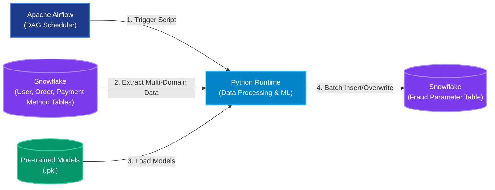
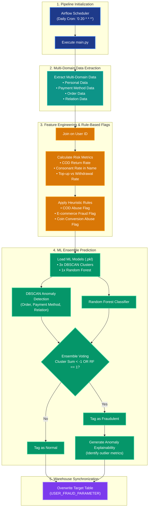
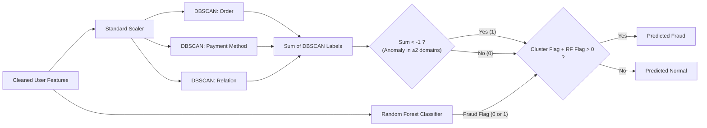

# Production-Grade ML Pipeline: User Fraud & Abuse Detection

This document serves as documentation for the end-to-end Machine Learning pipeline developed to identify fraudulent activities and abuse among users within a logistics and e-commerce platform. This system is designed to detect suspicious behavior, protect business revenue, and maintain a trusted ecosystem by combining rule-based heuristics with advanced anomaly detection models.

> [!NOTE]
> **🏆 Executive Summary (STAR Framework)**
> * **Situation**: The fraud team needed an automated way to proactively identify and prevent increasingly sophisticated fraudulent activities across the platform.
> * **Task**: Develop robust, data-driven "fraud parameters" to empower the fraud team to swiftly detect and neutralize malicious users.
> * **Action**: Engineered an end-to-end Machine Learning pipeline that monitors multi-domain behavioral data, applies heuristic rules, and leverages an ensemble of DBSCAN anomaly detection and Random Forest models to automatically tag fraudsters.
> * **Result**: **Successfully reduced financial losses due to fraud from Rp 30 million to under Rp 2 million.**

---

## 🚀 Architecture & Tech Stack

The architecture leverages a scheduled orchestration framework to extract data from Snowflake, process it through pre-trained machine learning models, and overwrite the results back to the database for downstream analytics and operational action.

| Technology | Role | Details & Rationale |
| :--- | :--- | :--- |
| **Apache Airflow** | **Orchestrator & Scheduler** | Schedules and monitors the pipeline daily (`0 20 * * *`). It uses `BashOperator` to trigger the main Python processing script and handles retries and failure alerts. |
| **Python** | **Processing & Inference Engine** | Executes the core logic: executing SQL queries, cleaning data with Pandas, calculating risk features, and running ML inference using Scikit-Learn. |
| **Snowflake** | **Data Warehousing** | Acts as both the data source (user directory, orders, mutations, login logs) and the target analytical warehouse (`USER_FRAUD_PARAMETER`), supporting scalable data extraction and ingestion. |

---

## 📊 End-to-End Process Flowchart

The diagram below details the operational sequence, starting from pipeline initialization down to preprocessing, feature engineering, ensemble predictions, and final warehouse synchronization.

---

## 🛠️ Deep Dive: Pipeline Execution & Algorithms

### 1. Multi-Domain Feature Extraction
To build a comprehensive profile of a user's behavior, the pipeline extracts data across four distinct domains using complex SQL transformations:
- **Personal Data:** Analyzes naming conventions (e.g., suspicious strings like "PT", "CV", or courier names in user profiles), phone number validity, and email formatting. It also computes the concentration of identical PII across the platform.
- **Payment Method Mutation:** Calculates top-up frequencies, withdrawal rates, and e-wallet usage ratios to identify potential money laundering or coin conversion abuse.
- **Order Data:** Aggregates total orders, return rates, COD (Cash on Delivery) volumes, and bulk upload behaviors to spot fake order generation or intentional package rejection.
- **Device & Relation Data:** Tracks the number of unique anonymous IDs, device IDs, browser fingerprints, and linked bank accounts associated with a single user to uncover fraud syndicates and multi-accounting.

### 2. Rule-Based Abuse Flaggings
Before ML inference, strict deterministic rules act as the first line of defense to flag blatant abuse:
- **COD Abuse:** Triggered if a user has placed >50 COD orders and rejects >25% of them.
- **E-Commerce Fraud:** Triggered if the user's registered name matches known suspicious keywords (e.g., masquerading as official platform accounts or logistic companies).
- **Coin Conversion Abuse:** Triggered if a user heavily tops up via e-wallets (>= 85% of top-ups) and withdraws funds without ever finishing a legitimate order.

### 3. The Ensemble ML Prediction Strategy
The core fraud detection mechanism utilizes an **Ensemble Classifier** combining unsupervised clustering and supervised classification:

#### Method A: Multi-Domain DBSCAN (Anomaly Detection)
Since fraudsters constantly evolve their tactics, relying solely on historical labeled data is insufficient. The pipeline utilizes **DBSCAN (Density-Based Spatial Clustering of Applications with Noise)** trained on three separate feature subsets (Order, Payment Method, Relation). 
- **Why it works:** DBSCAN identifies users who fall outside dense, "normal" behavioral clusters. It assigns a label of `-1` to these outliers.
- **Integration:** The pipeline dynamically computes the Euclidean distance between a user's feature vector and the core samples of the pre-trained DBSCAN model. If the shortest distance exceeds the `eps` threshold, the user is flagged as an anomaly.

#### Method B: Random Forest Classifier
A supervised Random Forest model is deployed to catch known, historical fraud patterns using the aggregated feature set.

#### Ensemble Logic & Explainability
A user is ultimately flagged as fraudulent if either the Random Forest predicts fraud OR they are flagged as an anomaly in **at least two of the three** DBSCAN models (i.e., the sum of DBSCAN labels is `< -1`). To ensure the results are actionable for the Risk Team, the pipeline includes an **Explainability Engine** that cross-references the user's metrics against expected `lower_bounds` and `upper_bounds`, attaching human-readable reasons (e.g., *"High value of cod_return_rate"*) to the final output.

---

## 💾 Database Synchronization Strategy
The pipeline leverages a streamlined Python-to-Data-Warehouse ingestion process.
1. **Environment Isolation:** The target schema dynamically switches based on Airflow Environment Variables (`DEV_MODE`), routing writes to a staging schema during development and the production schema during live runs.
2. **Batch Overwrite:** The resulting Pandas dataframe containing millions of predictions and anomaly explanations is directly loaded using an optimized bulk insert method (`overwrite`).

---

## 🛡️ Production & Operational Safeguards
- **Sensitive Credentials:** Database credentials (Users, Passwords, Roles, Accounts) are never hardcoded. They are securely retrieved using Airflow's `Variable.get()` at runtime.
- **Fail-Safe Monitoring:** The DAG utilizes `email_on_failure` and `email_on_retry` to alert data engineers in real-time if a workflow failure occurs, with automated retries configured for transient errors.
- **Idempotent Preprocessing:** The feature engineering pipeline handles missing data and null values defensively, ensuring that malformed tracking events or database outages do not crash the ML inference engine.
